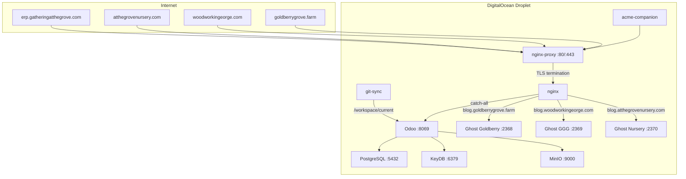
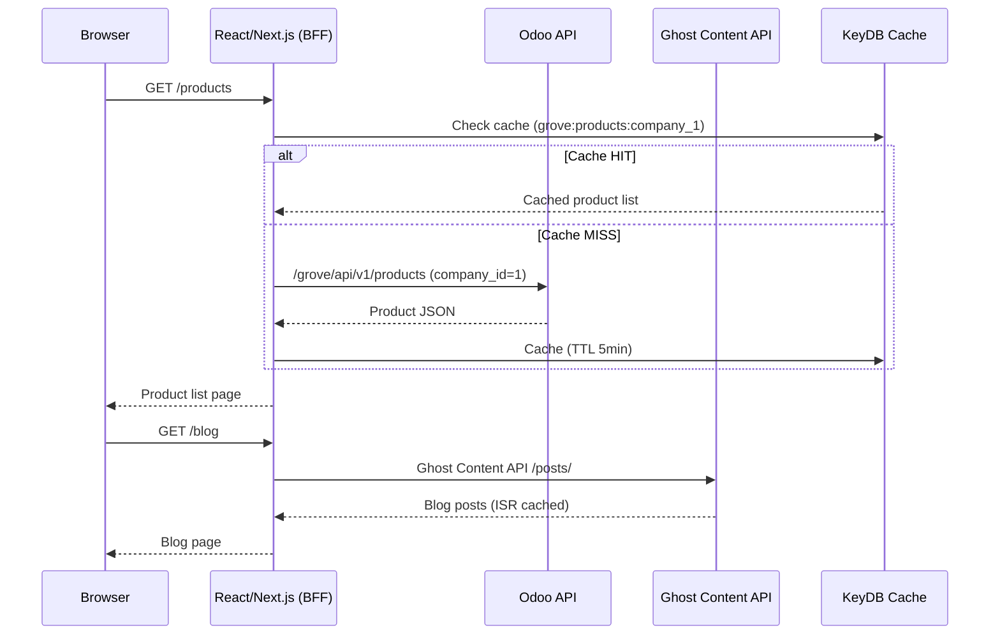
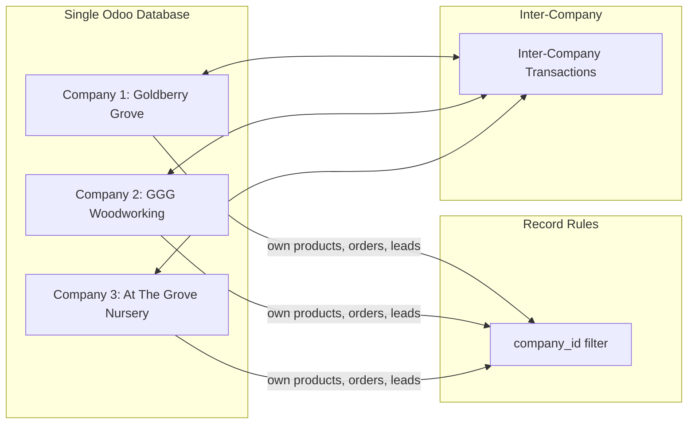
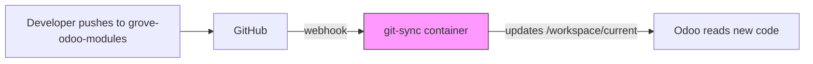

# Architecture

## System Topology

## Data Flow: React Website → Backend

## Multi-Company Model

Each API request includes a company context (derived from the website/domain). Odoo's ORM-level record rules enforce data isolation automatically. Inter-company transactions (e.g., GGG supplies lumber to Goldberry) are handled by Odoo's built-in inter-company module.

## Module Deployment

No Docker image rebuild needed. Polling interval: 30s. Webhook triggers instant sync.
